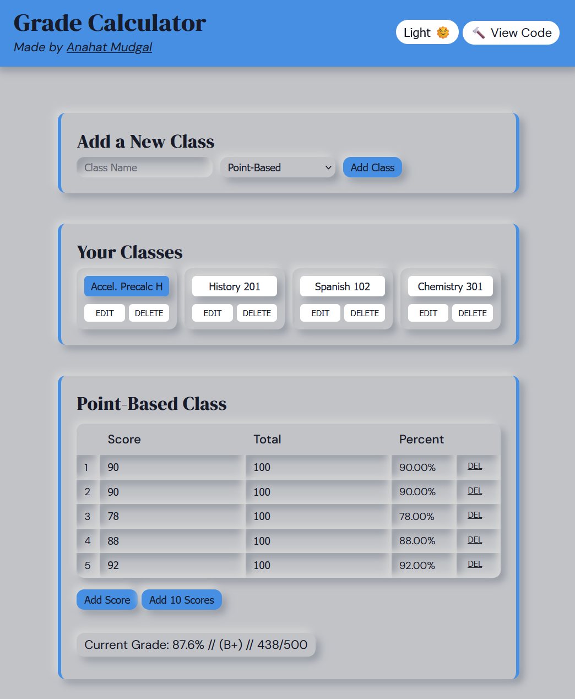
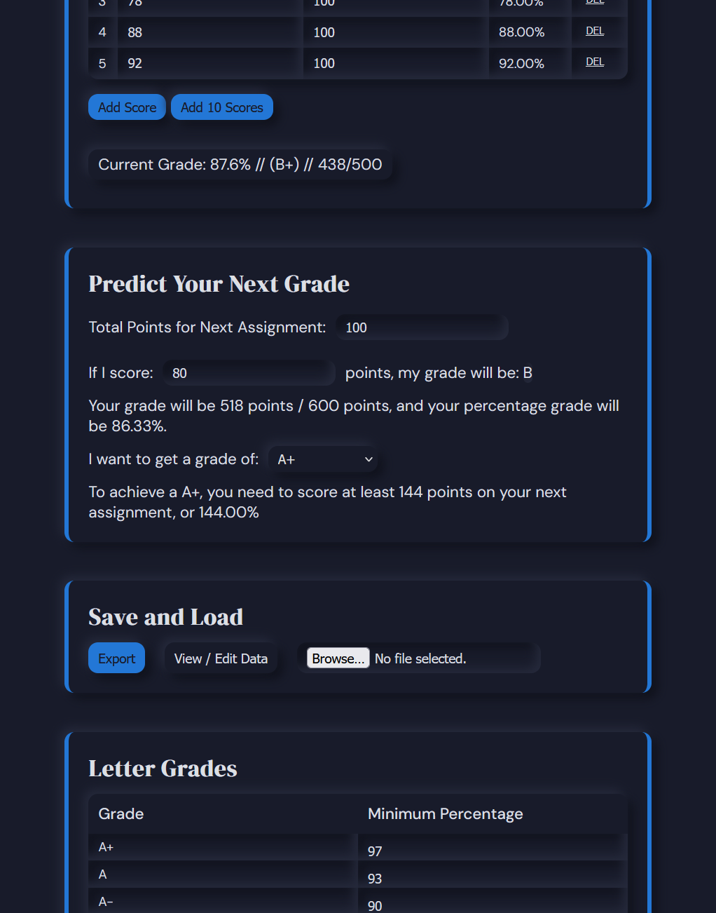
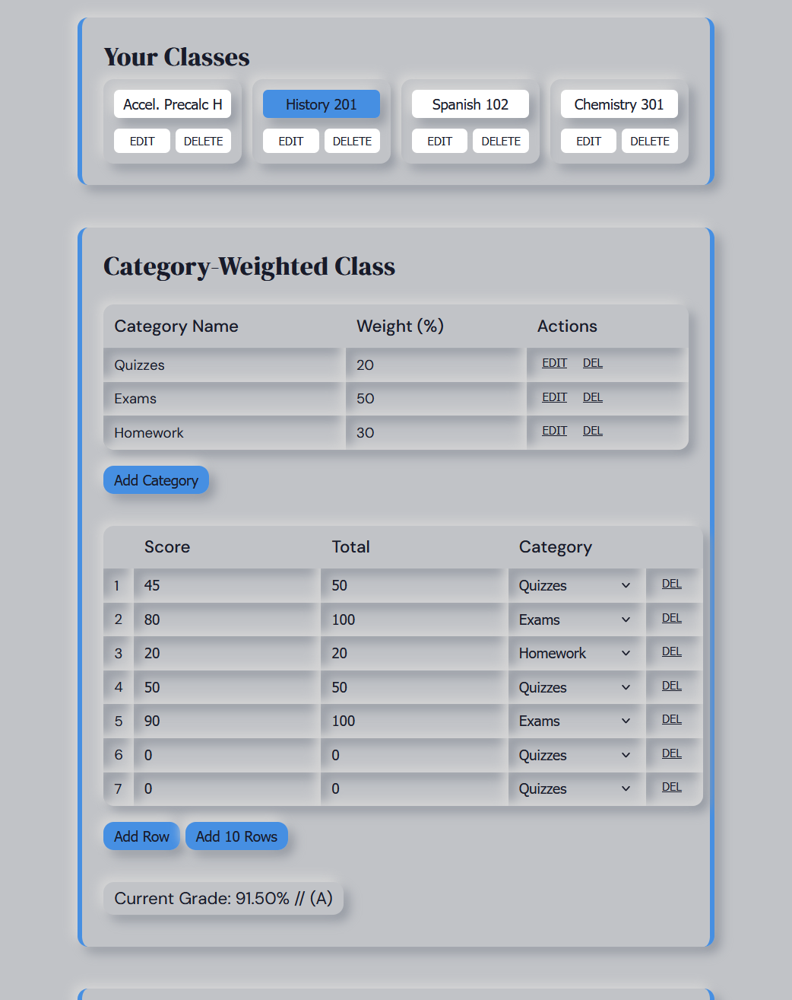
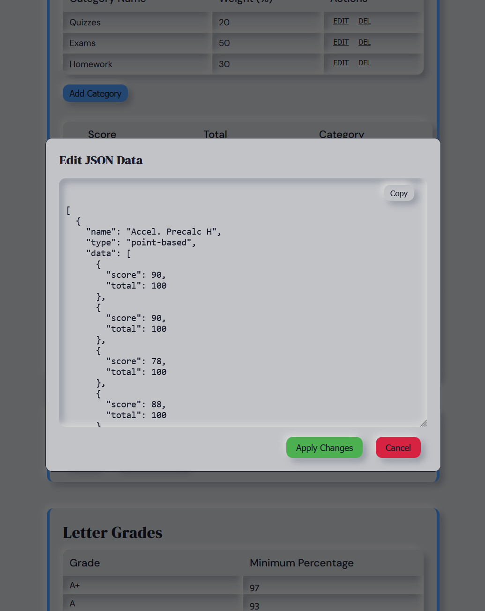
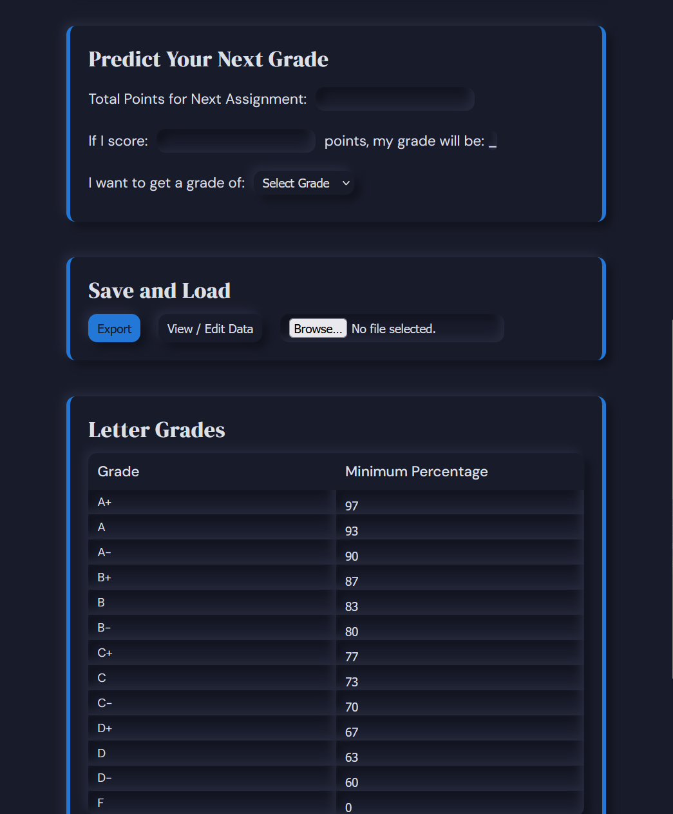

# Grade Calculator

React-based Grade Calculator application that allows users to manage classes, calculate grades using point-based or category-weighted systems, and predict future grades. It includes features like theme switching, data import/export, and customizable grade scales, with a clean and responsive UI.

 

## Features

- **Comprehensive Grade Management**: Manage multiple classes with both point-based and category-weighted grading systems, featuring real-time grade calculations and predictive analytics
- **Customizable Experience**: Personalize your grade scales and utilize theme switching between light and dark modes
- **Data Security & Flexibility**: Benefit from automatic local storage persistence with import/export functionality for data backup
- **Intuitive Interface**: Navigate effortlessly through a clean, modern neuromorphic design with interactive elements

## Technologies Used

- **Vite**: Next Generation Frontend Tooling
- **React**: A JavaScript library for building user interfaces
- **TypeScript**: Typed JavaScript at Any Scale

## Screenshots

The app features a modern and beautifully 3D user interface with support for both dark and light mode.

